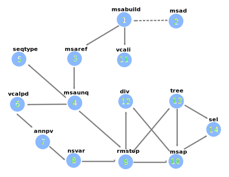

CoVa
====

Variant analysis pipeline for Coronavirus genomes. Specifically, SARS-CoV-2.
This pipeline build a whole-genome Multiple Sequence Alignment (MSA) and performs following analyses: 
 
* Variant calling
* Estimation of sequence diversity
* Sequence typing
* Phylogenetic inference
* Selection analysis

Following external programs are required:

- MAFFT        : Build Multiple Sequence Alignment
- FastTreeMP   : Build phylogeny
- Hyphy        : Perform selection analysis to identify sites under positive selection

Installation
-----------------

1. Create a python virtual environment, at a location of your choice. 

   a. Use the following command, or something equivalent.
   
   .. code-block:: bash

      python3 -m venv <path/name>

   Replace <path/name> by a path of your choice. 
   
   b. Activate this environment by running
   
   .. code-block:: bash

      source <path/name>/bin/activate

2. Clone this repository.

   .. code-block:: bash

      git clone https://github.com/A-Farhan/cova.git
 
3. Install the package from the binary distribution. 

   Find the latest release (*.whl) in the release section of cova's github page, Download and run.

   .. code-block:: bash
   
      pip install <full-path-to-release-file>
       
4. Install external programs.

   a. ``cd`` to cova repository

   b. Run ``./INSTALL.sh``. This is an interactive script. It will ask for the permission to proceed with each installation *viz*. MAFFT, FastTree and Hyphy. Appropriate response should be *y* (yes) OR *n* (no). If you have any of these programs already installed, then you can choose to skip its installation here.

   c. CoVa expects external programs to be available system-wide, by default. In other words, programs are invoked without providing the full path. If you installed external programs using the previous step, a new directory *local* will be created inside the repository. All 3 programs shall then be accessible from the path <repo-path>/local/bin/.

      You'll need to add the following line to your ~/.bashrc file.

      .. code-block:: bash

         export COVA_BIN_PATH=<repo-path>/cova/local/bin  

   d. You can also access your pre-installed external programs similarly without using full paths. Simply, add their respective paths to your PATH variable.

      .. code-block:: bash

         export PATH=$PATH:<full-path-to-external-program>
      
   e. You can also find instructions to download and install these programs from the following urls:

      	https://mafft.cbrc.jp/alignment/software/installation_without_root.html

      	http://www.microbesonline.org/fasttree/#Install

      	https://hyphy.org/download/
       
       

 

Run CoVa from the command-line
------------------------------

This pipeline is built to be run as a command-line tool **CoVa**

To check if the command is available, run the following command inside the virtual environment

.. code-block:: bash

   CoVa --help
   
CoVa runs in the curent directory by default. You can provide any directory-path through ``--indr`` option. 

CoVa expects a minimum input of a whole-genome multi-FASTA file under this path, named "genomes.fna" by default. Several commands require a reference accession [default: ``NC_045512``]. If this is not already present in the input file, it can be added by running accessory command ``preprocess`` ( more on this later).

To get familiar with CoVa, and its outputs, you can run CoVa on ``<repo-path>/datasets/example`` directory. You can also copy the input file (genomes.fna) from this directory into an empty directory of your choce, for a fresh run. 

CoVa has multiple subcommands, and these commands have their own arguments. To see these arguments, you can run, for example 

.. code-block:: bash

   CoVa msabuild --help
   
You can run these commands individually or in combination, with or without arguments, as all arguments have defaults. Combination works like this.

.. code-block:: bash

   CoVa --indr <full-path-to-input-directory> msabuild msaref msaunq
   
Not all combinations would work, of course. As many commands depend on the input from specific preceding command(s), it is a largely rigid chain. You can refer to the above graph for help on this. To run the entire pipeline, use the sub-command ``full``.

.. code-block:: bash

   CoVa full
   
which is equivalent to 

.. code-block:: bash
   
   CoVa msabuild msaref msaunq seqtype vcalpd anvpd nsvar rmstop msap vcali div tree sel

CoVa also allows to add more sequences and update results of a previous analysis. To do so, the main command can be run with the flag ``--addseq``. This flag is passed only to ``full`` command, i.e., if you want to add a new set of sequences to an existing MSA, and redo CoVa analysis, then you can run

.. code-block:: bash

   CoVa --addseq full

You can also use CoVa's cleanup command to remove a cova run's input/output files present in the working directory. It also includes an option to exclude a comma-separated list of files. This command is internally run by CoVa to update a previous analysis, wherein all cova-generated files except the initial alignment are first deleted, and then regenerated.

Other sub-commands are as follows:

Sub-commands
------------

**MSABUILD**

This command is a MAFFT wrapper to build whole-genome Multiple Sequence Alignments (MSA).
   
Input:

A multi-FASTA file of *unaligned* whole-genomes present in the working directory, named "genomes.fna" by default.

Output:

A multi-FASTA file of *aligned* whole-genomes present in the same directory, named "genome_aln.fna" by default.

**MSAD**

MAFFT allows for addition of new sequences to pre-existing MSAs. CoVa makes use of this feature to simplify incorporation of incoming genomic data and update analysis results. To facilitate rest of the analysis without changing any arguments, the MSA is changed in place and a copy is kept for back up. All the other analysis files are updated without a backup. If you wish to retain previous analysis, you can separately copy these files to a directory. 

Input:

MSA generated by ``msabuild``, "genome_aln.fna" by default.

A FASTA file of possibly multiple genome sequences to be incorporated in the above MSA, named "new_seq.fna" by default.

Output:

Updated input MSA file. Additionally, a copy of the input is generated, named "old_genome_aln.fna" by default. 

**MSAREF**

Before we can call variants ( point mutations and deletions) relative to a reference, our MSA must be restricted to the sites present in this reference. That's the job of this command.

Input:

MSA and a reference accession included in this MSA.

Output:

A multi-FASTA file of the above MSA limited to sites present in the given reference. default: "genome_aln_ref.fna"

**MSAUNQ**

Since it is possible that the original set of unaligned sequences, or the reference-limited MSA has duplicate sequences, it may be of interest to remove these duplicate sequences before further analysis. It would serve to speed up certain downstream analysis and also, to prevent polytomies in the phylogeny. 

Input:

MSA generated by ``msaref``.

Output:

A multi-FASTA file of the above MSA excluding any duplicate sequences, default: "genome_aln_unq.fna"

A tab-delimited table of duplicate genomes with following columns:, default: "genome_dups.tsv"
   
a. genome id included in the output MSA
b. comma-separated list of ids of genomes identical to the one selected 

**SEQTYPE**

Sequence typing is performed by CoVa using the genetic barcoding scheme suggested by Guan et al, 2020. For more details, refer to https://doi.org/10.1101/2020.04.21.054221

Input:

MSA generated by ``msaunq``

Output:

CSV with 2 columns for genome ids and their corresponding types respectively. default: "genome_types.csv"

**VCALPD**

Variant CALling ( Point mutations / Deletions).  

Input:

MSA generated by ``msaunq``.

Output:

"point_mutations.tsv": table with 1 row per point mutation and 1 column per genome, except the first 2 columns are for 1-indexed genomic coordinate and reference allele respectively.

"deletions.tsv": table with 1 row per deletion, and following columns:

a. pos - 1-indexed genomic coordinate of the first base of deletion
b. len - length of deletion
c. seq - deleted reference sequence
d. id  - Bits for absence(0) OR presence(1) of deletion in the respective genome. There is one id column for every genome in the MSA. 

**ANVPD**

ANNotation protein Variants w/ Point mutations or Deletions.

Input:

Point mutation table generated by ``vcalpd``.

Output:

"point_mutations_ann.tsv" w/ following columns:

a. protein_id - protein's accession in the reference genome
b. name 	     - common name or abbreviation for the protein
c. position   - 1-indexed genomic position
d. ref_base   - nucleotide at the above position in the reference
e. var_base   - a different allele at this position in some genome
f. ref_codon  - codon at this position in the protein-coding sequence of reference
g. var_codon  - modified codon due to nucleotide substitution in some genome
h. aa_change  - amino acid change due to this substitution
i. type       - (S)ynonymous or (N)on-synonymous change         
j. freq       - number of genomes w/ the mutation 
k. genomes 	  - comma-separated list of genome ids with this variant

"deletions_ann.tsv" w/ 4 columns:

a. pos   - 1-indexed genomic position
b. len   - length of the deletion
c. ann   - annotation if it's w/i protein-coding sequence
d. freq  - number of genomes w/ the deletion

**NSVAR**

It may be of interest to characterize each isolate in terms of its unique variants and the variants that it shares with the others, for further analyses. These results are summarized by this command. Also, only non-synonymous variants are considered, in the interest of readability of the output table. 

Input:

Annotated point mutation table generated by ``anvpd``.

Output:

A tab-delimited table with 1 row per genome and with following columns, default: "genome_vars.tsv"
  
a. genome    - genome id 
b. #variants - total number of variants in the genome
c. #shared   - number of shared non-synonymous variants
d. #unique   - number of unique non-synonymous variants
e. shared    - comma-separated list of shared variants
f. unique    - comma-separated list of unique variants

**RMSTOP**

Selection analysis performed by FUBAR throws an error if sequences with nonsense mutations are included in the MSA. This command removes such sequences from the MSA.

Input:

MSA generated by ``msaunq``

Output:

MSA without sequences with nonsense mutations. default: "genome_aln_sf.fna"

**MSAP**

This command extracts nucleotide MSAs for all proteins/peptides-encoding regions from the whole-genome reference limited MSA. These MSAs are later used for selection analysis on individual proteins.

Input:

MSA file generated by ``rmstop``.

A directory path to store output MSAs.

Output:

Nucleotide MSA files of individual protein/peptide-encoding regions. default: "prots_nmsa"

**VCALI**

Variant Calling for Insertions relative to a reference.

Input:

MSA file generated by ``msabuild``.

Output:

A tab-delimited table with 1 row per insertion and following columns, default: "insertions.tsv"

a. pos - 1-indexed genomic position of the reference base in the immediate left of the insertion
b. ref - the reference base at the above position
c. id  - either the reference base, if no insertion is present, OR the insertion sequence. There is 1 id column for every genome.

**DIV**

This command calculates Nucleotide Diversity for the whole-genome, as well as for all proteins/peptide-encoding regions. Nucleotide Diversity is the average pairwise-difference per base. Optionally, one can calculate diversity with a sliding window over the entire genome. This is handy in identifying hypervariable regions.

Input:

MSA generated by ``rmstop``.

MSAs of protein/peptide-encoding regions generated by ``msap``.

Output:

A comma-delimited table. First row is for the whole-genome and following rows are for other regions. First column is the region's name and second column is for its nucleotide diversity. default: "divs.csv"

**TREE**

This command builds whole-genome based phylogeny using FastTree.

Input:

whole-genome MSA generated by ``rmstop``.

Output:

Output tree generated by FastTree in NEWICK format. default: "tree.nwk"

**SEL**

This command runs HYPHY FUBAR which perform selection analysis on protein-encoding regions by estimating synonymous and non-synonymous rates. It also identifies putative sites under positive selection. 

Input:

MSAs generated by ``msap``.

Phylogeny tree generated by ``tree``.

Output:

Output files generated by FUBAR.

A comma-delimited table of *rates* with 1 row per protein and following columns:

a. protein 	- common name or abbreviation for the protein
b. exp_subs - expected substitution rate
c. syn 	- synonymous rate
d. nonsyn 	- non-synonymous rate
e. dnds 	- (nonsyn-syn) 

A comma-delimited table of *sites* with 1 row per site and following columns:

a. protein 	 - common name or abbreviation for the protein
b. site 	 - 1-indexed position in the protein
c. syn 	 - site-specific synonymous rate
d. nonsyn 	 - site-specific non-synonymous rate
e. post_prob - posterior probability (nonsyn > syn)

External commands
---------------------------------

**MAFFT**

Cova runs the following MAFFT command. To speed up the process, We use no more than 5 refinement iterations. For the same reason, we have assumed sufficient RAM would be available, and included ``--nomemsave`` option, since wide alignments, by default, triggers a 2X slower algorithm to reduce memory requirement. Furthermore, MAFFT within CoVa can be run in 3 modes:- Standard [Default], Fast, and Ultra.

.. code-block:: bash

   [standard] mafft --quiet --nomemsave --maxiterate 5 --thread <ncpu> <infile>
   [fast]     mafft --quiet --retree 2 --thread <ncpu> <infile>
   [ultra]    mafft --quiet --auto --thread <ncpu> --keeplength --addfragments <infile> <ref>
   

**FastTree**

FastTree in cova was built from the source with

* Double-precision: improves branch length precision for highly similar sequences, AND
* OpenMP: allows multi-threading for faster computations 

using the following command

.. code-block:: bash

   gcc -DUSE_DOUBLE -DOPENMP -fopenmp -O3 -finline-functions -funroll-loops -Wall -o FastTree FastTree.c -lm
   
Cova runs the following FastTree command. With speed and memory consideration, we limit split supports calculation to 100.

.. code-block:: bash

   FastTree -quiet -nt -mlnni 4 -boot 100

**Hyphy**

Cova makes use of Hyphy's **FUBAR** program to perform selection analysis and identify sites under positive selection. It runs FUBAR as below.

.. code-block:: bash

   hyphy fubar --alignment <msafile> --tree <treefile> --cache <cachefile>

Accessory programs
------------------

cova also has a few other programs packed along with the main pipeline. The programs can be cosidered accessory but quite useful in an analysis. These are:

**preprocess**

This command performs some preprocessing on the genomes FASTA file before submitting it to CoVa. It adds the reference, if not already present; makes headers pretty in FASTA files ( especially useful for phylogeny plots) and filters out sequences above a threshold of ambiguous characters ( default: 1%).

**extract_metadata**

If genomes were downloaded from GenBank or GISAID along with their metadata, this command extract from the metadata, information on collection date and location. The output can be used to annotate phylogeny plots.

**plottree**

Phylogeny plots are drawn using ETE3 ( which needs to be installed separately). The program is packed with a large number of options to tweak various aspects of the plot. It also includes the minimal annotation of sequence types provided ``seqtype`` output is available. Additionally, if ``extract_metadata`` output is provided, it'll include location and date annotations in the plot as well. 